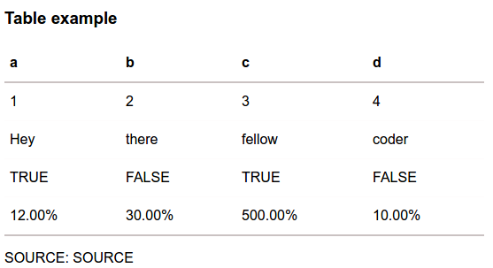
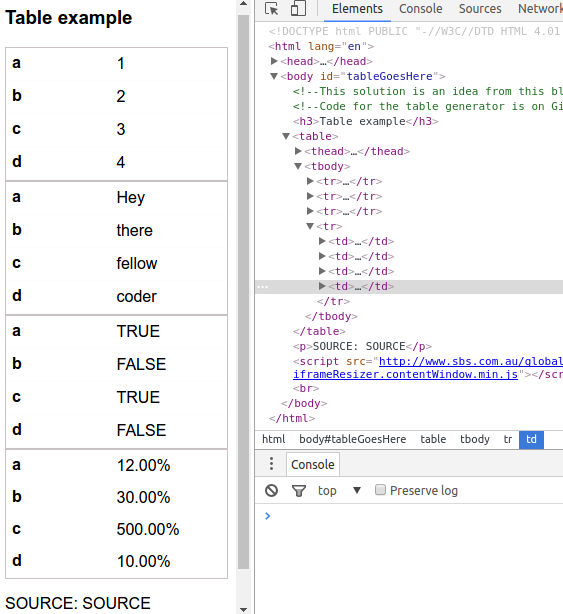

##No More Tables generator
###A soolution to building responsive tables for phone and PC alike.

The issue with tables is that on phone, any more than three columns will go off over to the right.

This website takes data from Excel or html tables (cut and paste) and creates a responsive table, based on the No More Tables CSS hack.

Allows you to set a breakpoint for the table.

If the device screen is smaller, the table folds under itself.

Currently this uses SBS style sheets, since SBS is my current employer, but you can replace those styles obviously.

###Installation

This is a self-contained website, so all scripts run in this folder. If you want the PHP to save directly to the ```tables/``` folder then you must give PHP write permissions on your server.

This website currently works on a LAMP stack server (Ubunutu OS and PHP installed).

###Usage

Be sure to check your data is in a format that will work. So, every column with data needs to have a descriptive heading, and there can be no blank columns or rows.

It's best to format your data in MS Excel before dropping it in (cut and paste). You can also load a CSV file.

When you've got the data in the window, and you've given it a name etc, you can set the breakpoint with the sliding bar.

You need to set the point at which the table will collapse in on itself. This is to ensure your table doesn't look bad on phone etc. If your display is thinner than the breakpoint, it will collapse.

Big screen - 


Small screen - 
 

The result is a html table that uses media queries to be responsive... no JavaScript needed.

This is not a perfect solution, but it beats having tables that go off into the never-never where users can not see them.

I will add more features, like the ability to pick an element and give it custom styles, using macros (all elements like this) and targeting elements specifically.

###Technical overview

This website consists of:

HTML
- a main page ```index.html``` which pulls everything into it. 
- a template page, which contains the table skeleton to spit out.

JS
- ```jquery``` vendor script, for making things easier
- ```processTableData.js``` - this forms up the table based on what the user selects. This pulls the table template and styles in and creates a single string, which is passed to the PHP script.

CSS
- ```siteStyles```
- ```tableStyles``` the styles for the actual table itself. This includes media queries and some funky CSS stuff to rearrange the table. The script will insert the breakpoints into the media queries for it to rearrange itself.

PHP
- ```saveTable.php``` this is what saves the table, and receives two paramaters. One is a timestamp (which becomes the filename) and a string (html and CSS stuck together). This saves everything in a single file eg - ```tables/141441411.html```

tables/
- Where PHP script saves the tables.

###Inspiration

This is a jquery solution to creating responsive tables, using the No More Tables CSS hack. To find out more, check out Chris Coyier's excellent example on [CSS-Tricks](https://css-tricks.com/responsive-data-tables/).

Twittter @jase_thomas